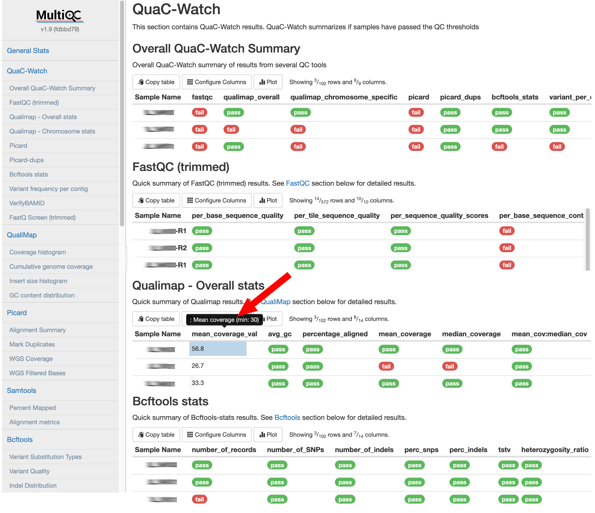

# QuaC-Watch

QuaC includes a tool called QuaC-Watch, which consumes results from several QC tools, compares QC metrics against the
acceptable thresholds, and summarizes results using color-coded `pass`/`fail` flags for efficient review.  This summary
allows users to quickly review output from multiple QC tools, identify whether samples meet expected quality thresholds,
and readily highlight samples that need further review. 

## Configs

We provide pre-defined thresholds for QC metrics as part of the QuaC repo and they need to be supplied via
`--quac_watch_config`:

* For Genome sequencing - `configs/quac_watch/wgs_quac_watch_config.yaml`
* For Exome sequencing - `configs/quac_watch/exome_quac_watch_config.yaml`

These thresholds were curated based on

* literature 
* in-house analyses using hundreds of GS and ES samples
* knowledge gained from our past sample QC experiences 

!!! info

    QuaC is built to use with Human WGS/WES data. If you would like to use it with non-human data, please modify the pipeline as needed -- especially the thresholds used in QuaC-Watch configs.

## QuaC-Watch in MultiQC report

QuaC aggregates QC results from multiple tools using MultiQC into a single stand-alone interactive HTML report.
QuaC-Watch results are available at the top of this report, and they serve as the first-stop for QC reviewers to quickly
check for sample quality. Here is an example screenshot:

Users may optionally toggle columns to view values for QC metrics of interest and hover over the column title to view
thresholds used by Quac-Watch (highlighted by red arrow). 